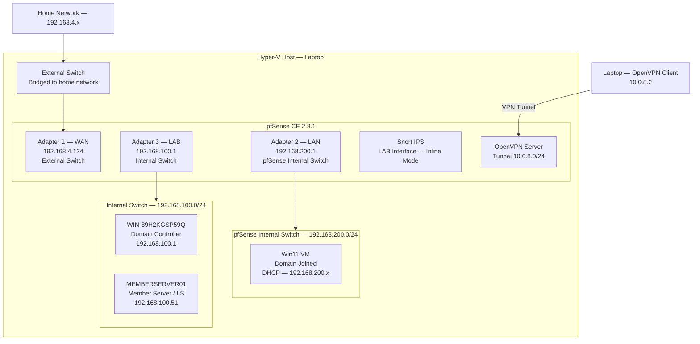
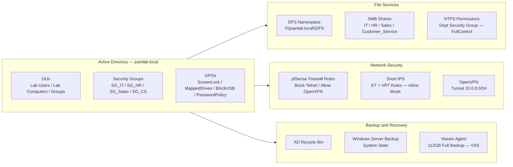

# HomeLab-SysAdmin
**Joan Estepan** | MD-102 Microsoft 365 Endpoint Administrator | BS Computer Science — SNHU

A fully documented Windows Server home lab built on Hyper-V running Windows Server 2025, covering Active Directory, Group Policy, file services, backup/recovery, network security, and VPN.

---

## Network Topology

---

## Lab Architecture

---

## Repository Structure

| Folder | Phase | Description |
|---|---|---|
| `AD_Structure/` | Phase 1 | OU hierarchy, users, security groups |
| `AD_BackUp/` | Phase 2 | AD Recycle Bin + Windows Server Backup |
| `Bulk_User_Creation/` | Phase 1 | PowerShell GUI tool for bulk AD user creation |
| `DHCP_Configurations/` | Phase 1 | DHCP scope, exclusions, options |
| `DNS_Verification/` | Phase 1 | DNS resolution testing |
| `GPOS/` | Phase 1 | Group Policy — ScreenLock, MappedDrives, BlockUSB, PasswordPolicy |
| `MemberServer/` | Phase 1 | IIS web server, domain join, file services |
| `Veeam/` | Phase 2 | Veeam Agent backup + file-level restore |
| `PFSense/` | Phase 3 | Firewall rules, logging, traffic testing |
| `Snort/` | Phase 3 | IPS inline mode, ET + VRT rules, alert testing |
| `OpenVPN/` | Phase 3 | VPN server config, PKI, client tunnel |

---

## Lab Specs

| Component | Details |
|---|---|
| Hypervisor | Hyper-V on Windows 11 laptop |
| Domain | `joanlab.local` |
| DC Hostname | `WIN-89H2KGSP59Q` |
| DC IP | `192.168.100.1` |
| Member Server | `MEMBERSERVER01` — `192.168.100.51` |
| Lab Subnet | `192.168.100.0/24` |
| pfSense LAN | `192.168.200.0/24` |
| VPN Tunnel | `10.0.8.0/24` |
| Server OS | Windows Server 2025 |
| Firewall | pfSense CE 2.8.1 |
| IPS | Snort 2.9.20 |
| Backup | Veeam Agent for Windows Free |
| Virtual Switches | External Switch / Internal Switch / pfSense Internal Switch |

---

## Phases

### Phase 1 — Server Administration
- Active Directory domain from scratch — OUs, users, security groups
- GPOs — screen lock, USB blocking, password policy, mapped drives with item-level targeting
- DHCP scope with exclusions and options
- DNS verification
- DFS namespace with department-scoped shares and NTFS permissions
- IIS web server on member server with custom internal portal page
- PowerShell bulk user creation tool with GUI

### Phase 2 — Backup and Recovery
- AD Recycle Bin enabled and tested — delete and restore user with full attributes
- Windows Server Backup — system state backup completed
- Veeam Agent — 112GB full backup (VSS), file-level restore tested

### Phase 3 — Firewall and Network Security
- pfSense firewall — WAN/LAN rules, telnet block with logging
- Snort IPS — inline mode on LAB interface, ET + VRT rules, alerts confirmed
- OpenVPN — PKI setup, server config, client tunnel tested from laptop to DC

### Phase 4 — Hybrid Identity (Coming Soon)
- Microsoft Entra ID tenant (E5 trial)
- Azure AD Connect — sync `joanlab.local` to cloud
- Hybrid domain join
- Conditional Access policies
- Microsoft Intune enrollment

---

## Tools and Technologies

`Windows Server 2025` `Active Directory` `Group Policy` `PowerShell` `DFS` `DHCP` `DNS` `IIS` `pfSense` `Snort` `OpenVPN` `Veeam` `Hyper-V` `Entra ID` `Intune`

---

## Certifications
- MD-102 — Microsoft 365 Endpoint Administrator
- BS Computer Science — Southern New Hampshire University (GPA 3.8)
