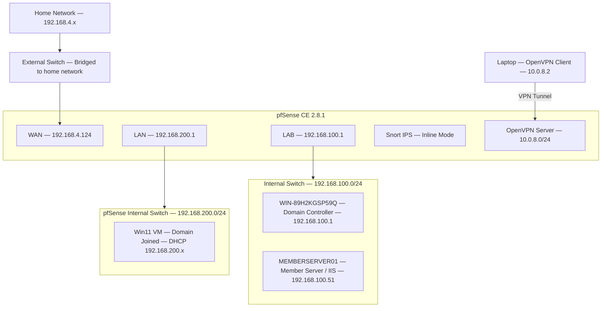
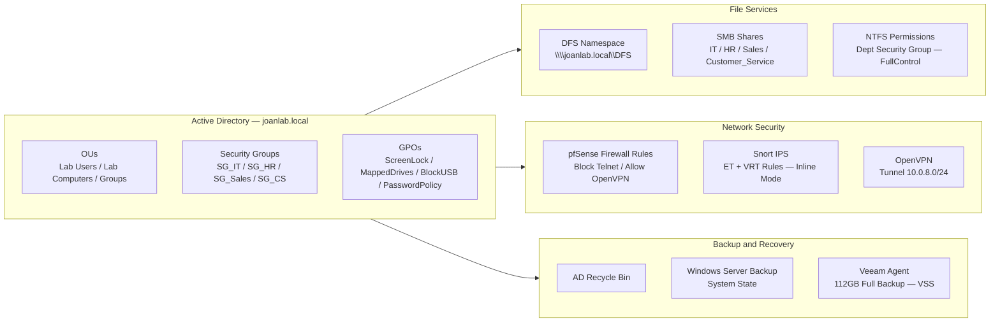

# HomeLab-SysAdmin
**Joan Estepan** | Microsoft 365 Certified: Administrator Expert (MS-102) | MD-102 Microsoft 365 Endpoint Administrator | BS Computer Science — SNHU

A fully documented Windows Server home lab built on Hyper-V running Windows Server 2025, covering Active Directory, Group Policy, file services, backup/recovery, network security, and VPN.

---

## Network Topology


```mermaid
flowchart TD
    HomeNet["Home Network — 192.168.4.x"]
    ExternalSwitch["External Switch — Bridged to home network"]

    subgraph pfSense["pfSense CE 2.8.1"]
        WAN["WAN — 192.168.4.124"]
        LAN["LAN — 192.168.200.1"]
        LAB["LAB — 192.168.100.1"]
        Snort["Snort IPS — Inline Mode"]
        OV["OpenVPN Server — 10.0.8.0/24"]
    end

    subgraph pfSenseSwitch["pfSense Internal Switch — 192.168.200.0/24"]
        Win11["Win11 VM — Domain Joined — DHCP 192.168.200.x"]
    end

    subgraph InternalSwitch["Internal Switch — 192.168.100.0/24"]
        DC["WIN-89H2KGSP59Q — Domain Controller — 192.168.100.1"]
        MS["MEMBERSERVER01 — Member Server / IIS — 192.168.100.51"]
    end

    Laptop["Laptop — OpenVPN Client — 10.0.8.2"]

    HomeNet --> ExternalSwitch
    ExternalSwitch --> WAN
    LAN --> pfSenseSwitch
    LAB --> InternalSwitch
    Laptop -->|VPN Tunnel| OV
```

---

## Lab Architecture


```mermaid
flowchart LR
    subgraph AD["Active Directory — joanlab.local"]
        OU["OUs\nLab Users / Lab Computers / Groups"]
        SG["Security Groups\nSG_IT / SG_HR / SG_Sales / SG_CS"]
        GPO["GPOs\nScreenLock / MappedDrives / BlockUSB / PasswordPolicy"]
    end

    subgraph FileServices["File Services"]
        DFS["DFS Namespace\n\\\\joanlab.local\\DFS"]
        Shares["SMB Shares\nIT / HR / Sales / Customer_Service"]
        NTFS["NTFS Permissions\nDept Security Group — FullControl"]
    end

    subgraph Security["Network Security"]
        FW["pfSense Firewall Rules\nBlock Telnet / Allow OpenVPN"]
        IPS["Snort IPS\nET + VRT Rules — Inline Mode"]
        VPN["OpenVPN\nTunnel 10.0.8.0/24"]
    end

    subgraph Backup["Backup and Recovery"]
        Recycle["AD Recycle Bin"]
        WSB["Windows Server Backup\nSystem State"]
        Veeam["Veeam Agent\n112GB Full Backup — VSS"]
    end

    AD --> FileServices
    AD --> Security
    AD --> Backup
```


---
## Active Directory Hierarchy

```
joanlab.local
└── My Lab
    ├── Lab Users
    │   ├── IT
    │   ├── HR
    │   ├── Sales
    │   └── Customer_Service
    ├── Lab Computers
    │   ├── Servers
    │   │   ├── WIN-89H2KGSP59Q (Domain Controller)
    │   │   └── MEMBERSERVER01 (Member Server)
    │   └── Workstations
    │       └── Win11 VM
    └── Groups
        └── Security Groups
            ├── SG_IT
            ├── SG_HR
            ├── SG_Sales
            ├── SG_Customer_Service
            ├── SG_Admins
            └── SG_ServiceAccounts
```

---

## Repository Structure

| Folder | Phase | Description |
|---|---|---|
| `AD_Structure/` | Phase 1 | OU hierarchy, users, security groups |
| `AD_BackUp/` | Phase 2 | AD Recycle Bin + Windows Server Backup |
| `Bulk_User_Creation/` | Phase 1 | PowerShell GUI tool for bulk AD user creation |
| `DHCP_Configurations/` | Phase 1 | DHCP scope, exclusions, options |
| `DNS_Verification/` | Phase 1 | DNS resolution testing |
| `GPOS/` | Phase 1 | Group Policy — ScreenLock, MappedDrives, BlockUSB, PasswordPolicy |
| `MemberServer/` | Phase 1 | IIS web server, domain join, file services |
| `Veeam/` | Phase 2 | Veeam Agent backup + file-level restore |
| `PFSense/` | Phase 3 | Firewall rules, logging, traffic testing |
| `Snort/` | Phase 3 | IPS inline mode, ET + VRT rules, alert testing |
| `OpenVPN/` | Phase 3 | VPN server config, PKI, client tunnel |
| `EntraConnect/` | Phase 4 | Entra Connect Sync, Hybrid Azure AD Join via GPO |
| `ConditionalAccess/` | Phase 4-5 | MFA, legacy auth blocking, risk-based CA policies |
| `Intune/` | Phase 4 | MDM enrollment, compliance policy, config profiles |
| `IdentityProtection/` | Phase 5 | Risk-based CA policies, PIM, access reviews |
| `Defender/` | Phase 6 | Safe Links, Safe Attachments, Anti-phishing, MDCA |
| `Purview/` | Phase 7-8 | Sensitivity labels, DLP, retention, eDiscovery, audit |

---

## Lab Specs

| Component | Details |
|---|---|
| Hypervisor | Hyper-V on Windows 11 laptop |
| Domain | `joanlab.local` |
| DC Hostname | `WIN-89H2KGSP59Q` |
| DC IP | `192.168.100.1` |
| Member Server | `MEMBERSERVER01` — `192.168.100.51` |
| Lab Subnet | `192.168.100.0/24` |
| pfSense LAN | `192.168.200.0/24` |
| VPN Tunnel | `10.0.8.0/24` |
| Server OS | Windows Server 2025 |
| Firewall | pfSense CE 2.8.1 |
| IPS | Snort 2.9.20 |
| Backup | Veeam Agent for Windows Free |
| Virtual Switches | External Switch / Internal Switch / pfSense Internal Switch |

---

## Phases

### Phase 1 — Server Administration
- Active Directory domain from scratch — OUs, users, security groups
- GPOs — screen lock, USB blocking, password policy, mapped drives with item-level targeting
- DHCP scope with exclusions and options
- DNS verification
- DFS namespace with department-scoped shares and NTFS permissions
- IIS web server on member server with custom internal portal page
- PowerShell bulk user creation tool with GUI

### Phase 2 — Backup and Recovery
- AD Recycle Bin enabled and tested — delete and restore user with full attributes
- Windows Server Backup — system state backup completed
- Veeam Agent — 112GB full backup (VSS), file-level restore tested

### Phase 3 — Firewall and Network Security
- pfSense firewall — WAN/LAN rules, telnet block with logging
- Snort IPS — inline mode on LAB interface, ET + VRT rules, alerts confirmed
- OpenVPN — PKI setup, server config, client tunnel tested from laptop to DC

### Phase 4 — Hybrid Identity
- Entra Connect Sync — synced `joanlab.local` to M365 tenant (jnj1124.com) via Password Hash Sync
- Hybrid Azure AD Join configured via GPO (`Register domain joined computers as devices`)
- Automatic MDM enrollment enabled — LABVM1 enrolled in Intune and verified Compliant
- Compliance policy (BitLocker + min OS version) and configuration profile deployed via Intune
- Conditional Access policies — MFA for all users, block legacy auth, require compliant/hybrid joined device

### Phase 5 — Identity Protection & PIM
- Risk-based Conditional Access policies (User risk: High → password change, Sign-in risk: Medium+ → MFA)
- Note: Native Identity Protection risk policy blade deprecated in current Entra portal — CA is the correct implementation path
- PIM configured — Global Admin converted from permanent to Eligible assignment
- PIM activation requires MFA + justification, 1-hour max duration
- Monthly Access Review configured for Global Admin role

### Phase 6 — Microsoft Defender
- Defender for Office 365 — Safe Links, Safe Attachments (Dynamic Delivery), Anti-phishing with mailbox intelligence and DMARC enforcement
- Attack Simulator — simulated phishing campaign run against lab users
- Defender for Cloud Apps — 21 active anomaly detection policies including Impossible Travel, Suspicious Inbox Forwarding, Ransomware Activity

### Phase 7 — Microsoft Purview
- Sensitivity label hierarchy — Public, Internal, Confidential (with encryption + content marking), sublabels
- Mandatory labeling enforced via label policy scoped to All users
- Auto-labeling policy configured for SSN, Credit Card, Bank Account, ABA Routing patterns
- DLP policy — financial/PII template, simulation → enforcement, policy tips confirmed in Outlook
- Retention policy — 7 years retain then delete, scoped across Exchange, SharePoint, OneDrive, M365 Groups

### Phase 8 — eDiscovery & Audit
- eDiscovery Standard case — keyword search returned 20 matches (11 mailbox + 9 SharePoint)
- Legal hold applied to 2/2 locations, verified via PowerShell (Unified Hold GUID confirmed)
- Audit log searches completed — timestamped user/IP/action entries confirmed
- Audit retention policy — 1 Year Hold, priority 1, all users and record types

---

## Tools and Technologies

`Windows Server 2025` `Active Directory` `Group Policy` `PowerShell` `DFS` `DHCP` `DNS` `IIS` `pfSense` `Snort` `OpenVPN` `Veeam` `Hyper-V` `Microsoft Entra ID` `Entra Connect Sync` `Password Hash Sync` `Hybrid Azure AD Join` `Conditional Access` `Zero Trust` `MFA` `Microsoft Intune` `MDM` `BitLocker` `PIM` `Just-In-Time Access` `Identity Protection` `Defender for Office 365` `Safe Links` `Safe Attachments` `Anti-phishing` `DMARC` `Attack Simulator` `Defender for Cloud Apps` `MDCA` `Microsoft Purview` `Sensitivity Labels` `DLP` `Retention Policies` `eDiscovery` `Legal Hold` `Audit Logs`

---

## Certifications
- MS-102 — Microsoft 365 Certified: Administrator Expert ✅
- MD-102 — Microsoft 365 Endpoint Administrator ✅
- BS Computer Science — Southern New Hampshire University (GPA 3.8)
